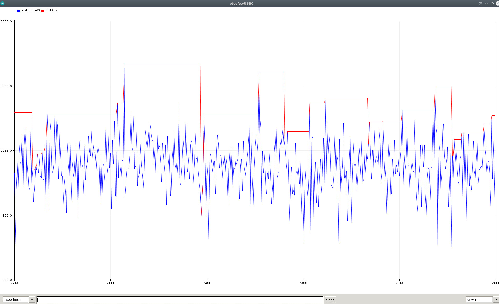
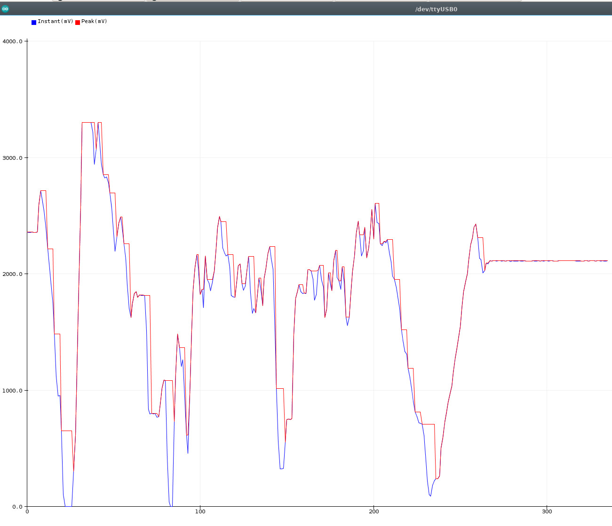
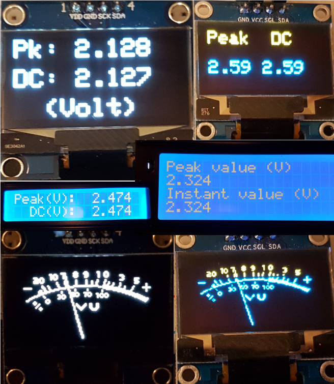
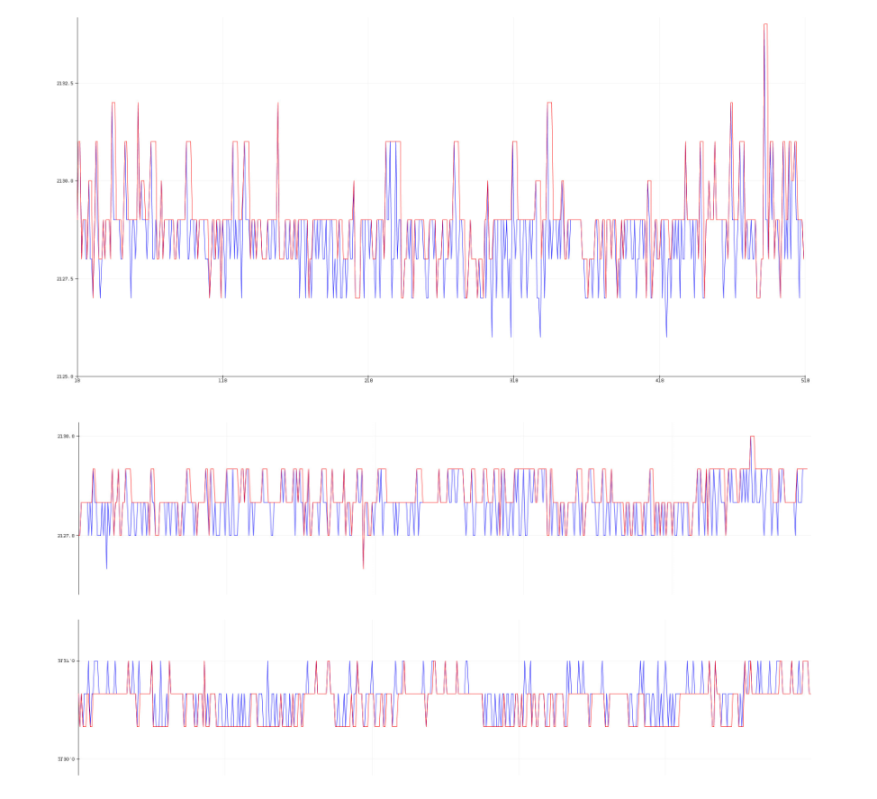

[](https://github.com/berrak/SensorWLED/blob/master/LICENSE)
[](https://www.ardu-badge.com/SensorWLED)
[](https://github.com/berrak/SensorWLED/releases/latest)
[](https://github.com/berrak/SensorWLED/releases/latest)
[](https://github.com/berrak/SensorWLED/stargazers)
[](https://github.com/berrak/SensorWLED/issues)
[](http://berrak.github.io/SensorWLED/)


# Arduino library SensorWLED

The Arduino library `SensorWLED` splits the input from a varying analog signal from the ADC into components, i.e., provides the capability of a `sample-and-hold` circuit. The library has methods that return ADC input as read (*instant*), while other functions hold the peak sampled value while decaying with user-set decay parameters.

## Use cases

- Create microphone input VU-meters.
- Trigger a high-volume event action with, for example, a microphone.
- Observe disturbances/noise/spikes on a steady DC level which occur widely apart in time.
- Keep peak value, i.e., the sample reading on display, long enough for humans to record the value.
- Use it for a voltage display with built-in calibration routines for improved accuracy.
- Scale up the attenuated resistor network input voltage to match the displayed voltage.
- Measure WLED peak electrical current with a sensor like the [WLED DC Sensor Board](https://github.com/berrak/WLED-DC-Sensor-Board).

The library was designed explicitly with the last point in mind, i.e., for measuring fast-changing Neopixel pixel currents. Unfortunately, the varying current level is often only roughly estimated when creating WLED-based projects.

## First example for an ESP32 (or an ESP8266)

In the Arduino IDE, scroll down the long list below `File->Examples` and find `SensorWLED`. Many examples use the Arduino library [Rdebug](https://github.com/berrak/Rdebug) for convenience but are not strictly part of the library itself. However, the Arduino `EEPROM` library is required.

```cpp
#include <SensorWLED.h>

// Instantiate a SensorWLED object with the ESP32 ADC input pin.
SensorWLED ProbeOne(33);    // use pin 0 for ESP8266

double mv_value ;           // Instant ADC value
double mv_pk_value ;        // Peak ADC value
```
Define in the setup() section the required library parameters and call the begin-method, for example:

```cpp
void setup() {
    Serial.begin(9600);
    delay(250); 

    ParamsOne = {
        .bits_resolution_adc = bits12,      // Use 'bits10' for an ESP8266
        .mv_maxvoltage_adc = mv_vcc_3v3,
        .ms_poll_time = 250,
        .ms_hold_time = 1000,  
        .decay_model = exponential_decay,
        .decay_rate = 1,
    };

    ProbeOne.begin(ParamsOne);  // Sets all parameters
}
```

In the loop() function, the two primary methods are to retrieve and display the peak sample and instant ADC values.

```cpp
void loop() {

    // True at set 'ms_poll_time'
    if (ProbeOne.updateAnalogRead() == true) {
        mv_value = (double) ProbeOne.getMappedValue();
        mv_pk_value = (double) ProbeOne.getMappedPeakValue();
        Serial.print(mv_value);
        Serial.print(",");
        Serial.print(mv_pk_value);
        Serial.println();
    }

    /* Do other tasks */
}
```

## Understand the parameters: hold_time, decay_model, and decay_rate 

These three parameters affect the hold function behavior. If the ADC input is a step function from a `HIGH` to a `LOW` level and stays `LOW`, you may see an actual decaying signal. Every time the *instant* input ADC value is higher than the previous value, the sampled peak value will track that until it is lower again. 



*The hold-time is only applied on a decreasing voltage, as shown above.*

The value set with `decay_rate` is a multiplication factor to the instant value. With the decay_model *linear_decay*, the `decay_rate` value has to be less than one. With the decay_model *exponential_decay*, the used factor is `exp(-decay_rate)`. The choice of model depends on how the sample value should decrease at the set `hold_time` event. The two timers are evaluated only in the `updateAnalogRead` method.

## I2C display example



*The examples sketches with 0.96" OLED 128x64 SSD1306, 1.3" OLED 128x64 SH1106G, and 2x16 or 4x20 LCD I2C displays*


## Calibration and improved instant ADC readings

Instantiating parameters can be used to improve accuracy.

```cpp
 // Constructor, default: no calibration or averaging smoothing samples applied
    SensorWLED(uint16_t analog_pin, float mv_offset = 0.0, float slope = 1.0, 
                                                        uint16_t samples = 0 );
```
The `mv_offset` sets the zero offset if the ADC reading does not show zero voltage with the input tied to GND.
The `slope` adjusts the reading when calibrated with a reference voltage. Reduce the ADC voltage to increase the input range, and adjust the readout with the `slope` parameter.
Finally, reduce the volatility of readings by increasing the number of `samples`. The calling function returns the calculated average.



*The effect of ADC values with 'samples' set equal to zero (i.e., no sampling), five and ten averaging samples.*

```cpp
// SensorWLED.h
#if !defined(US_ADC_CONVERSION_TIME)
    #define US_ADC_CONVERSION_TIME 250		// microseconds
#endif
```

Smooth the ADC readings in the preset time window for the period `samples x US_ADC_CONVERSION_TIME`. The time between each new sample in the averaging calculation is very conservative to ensure that the microcontroller has enough time to complete each ADC conversion cycle. Redefine if required in the sketch.

## EEPROM methods

The library requires the Arduino standard EEPROM library. The `begin` method saves all parameters to the flash-emulated EEPROM on the ESP32/ESP8266. 
In addition, the built-in CRC32 checksums test to ensure no unnecessary write operations. 

- Each ADC-channel instance has its dedicated memory area to save its configuration data.

In addition, there are auxiliary methods to read/write/calculate crc32, etc. 

Currently, there is no simple way to change the running parameters dynamically. However, a future enhancement objective is to implement this functionality.

## Documentation (GitHub Pages - Doxygen)

[Library documentation](https://berrak.github.io/SensorWLED/classSensorWLED.html).

## How to Install

Click on the green `Library Manager` badge above for instructions,
or use the alternative manual installation procedure.

1. Navigate to the [Releases page](https://github.com/berrak/SensorWLED/releases).
1. Download the latest ZIP archive in `~/Arduino/libraries`.
1. Unzip the archive.
1. Rename the new directory. Remove *version-code* or *master* in the name like this for `SensorWLED`.
1. Restart Arduino IDE.
1. In Arduino IDE, scroll down the long list below `Sketch->Include Library` and find `SensorWLED`.


## Are you curious about the tiny 'Sensor WLED board'?

You can purchase all the latest designed boards on `Tindie`.

[](https://www.tindie.com/stores/debinix/)

We appreciate your support.

## References

[1] Aircookie's [WLED](https://github.com/Aircoookie/WLED).
[2] atuline's [Sound Reactive WLED](https://github.com/atuline/WLED).